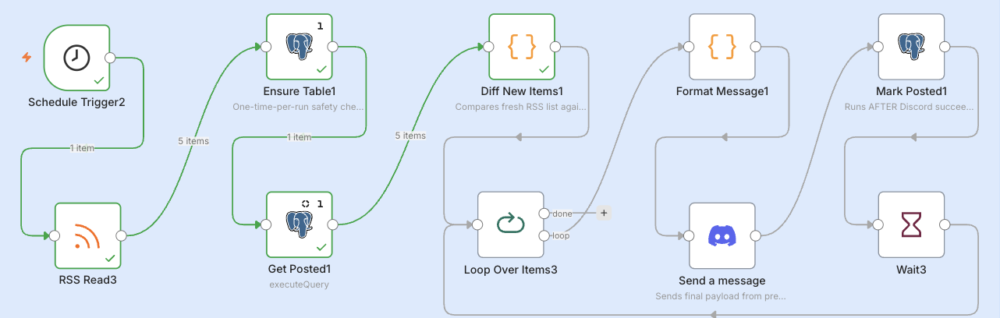
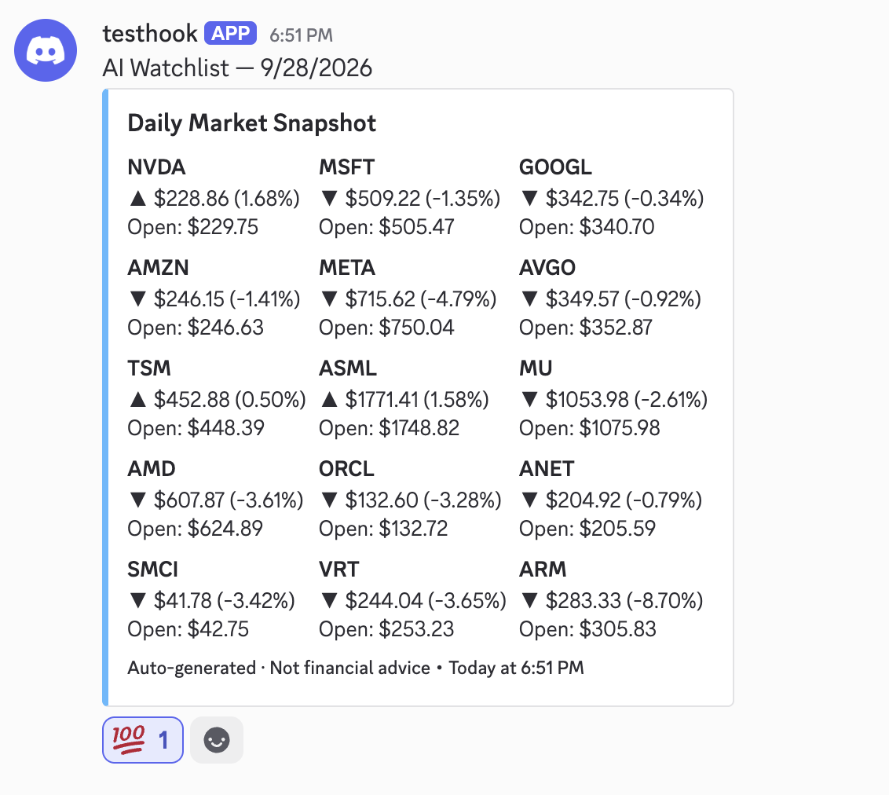
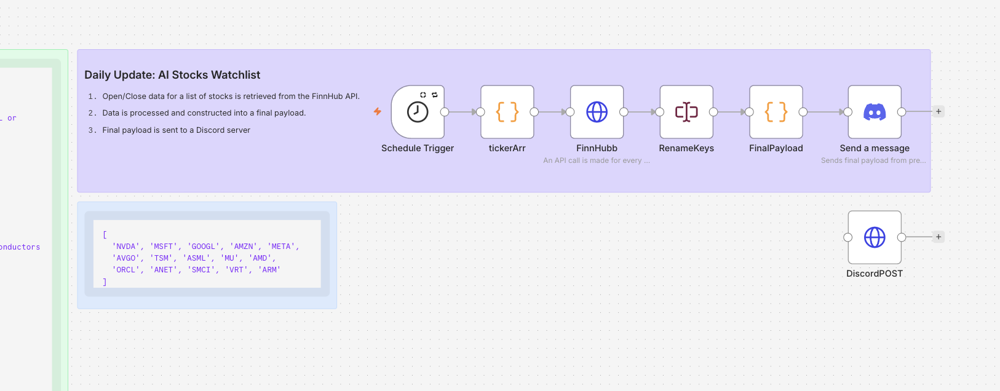
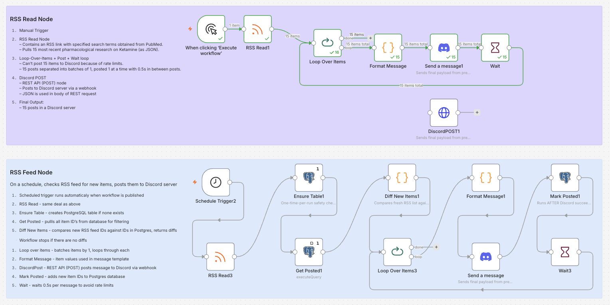

# ⚡️ n8n Automations ⚡️

## Getting Started
Clone the repo as usual.

## Getting Started with Docker 🐳
If you need to install Docker, here are two common options:

1. Download Docker Desktop and follow installation instructions. 
   This lets you easily manage images and containers through Docker Desktop's GUI. This is generally the simplest way to get started with Docker, but you will still want to go to your code editor for this project since it involves cloning a repo and using a compose file.
2. Install Docker (engine and CLI) through the terminal and install the `Container Tools` extension in VS Code (or an equivalent extension in another code editor). `Container Tools` provides an interface for managing images and containers.

### Spin Up Docker Containers
The complete configuration is ready in `docker-compose.yml`.

From your code editor, change to the project root and run:
```
docker compose up -d
```
Note: You will need to configure `credentials`, such as the Discord webhook and Finnhub API key, in the n8n app.

### Import Workflows
```
docker compose exec n8n n8n import:workflow --separate --input=/workflows
```

### Export Workflows
If you are using n8n without a paid subscription, GUI export is disabled. You can export workflows through the terminal instead.

Run each command individually:
```
docker exec <n8n-CONTAINER-NAME> n8n export:workflow --backup --output=/tmp/workflows/

docker cp <n8n-CONTAINER-NAME>:/tmp/workflows/. <PATH/TO/WORKFLOWS/FOLDER>

ls <PATH/TO/WORKFLOWS/FOLDER>
```
The last command tells you what files are in the `/workflows` folder.

## Getting Started With n8n (Locally)
You should have 2 containers: one for **n8n** and one for **n8n-db** (PostgreSQL database). Once the containers are live, you can go to `localhost:5678` to visit the app.

### Add `Credentials`
Nodes often use API's and Webhooks. It's better to set them up as `credentials` instead of putting them directly into nodes because including them directly in nodes will also include them in plain JSON when you export your workflow. Using a `.env` file, and calling on env vars is also an option. You would have to adjust the n8n service in the Docker compose to import the env vars, and to allow nodes to access env vars. 

These demos use a FinnHub API key (free), and a Discord webhook (free).

## Demo Workflows
### Scheduled API Call Example
Pulling opening and closing data for an AI stocks watchlist at market close, then sending the results to Discord.


*Final result.*


*Screenshot of the node and edge configuration.*

### Scheduled RSS Feed Example

*Screenshot of the node and edge configuration.*
*Check the Postgres node `ENSURE TABLE` if it includes the `truncate table` line. If present, remove it. That line is just for troubleshooting and clears all previous data. With it, the automation never recognizes diffs and reposts the same content over and over again.*